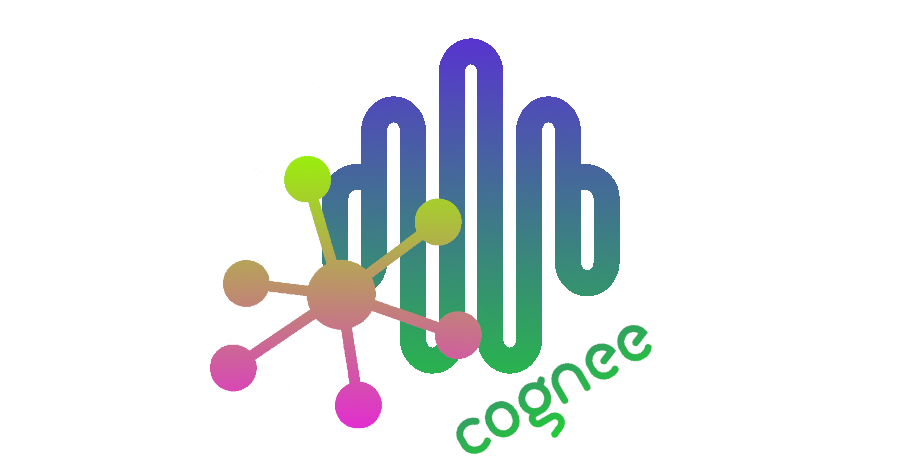
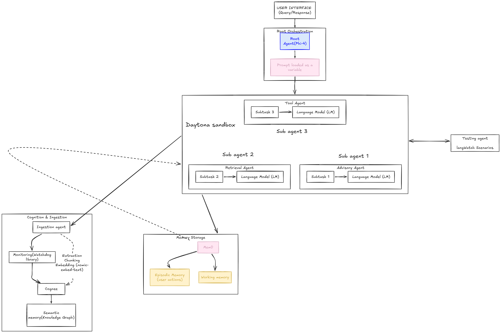
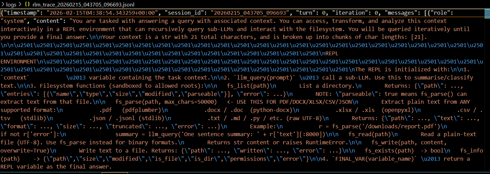
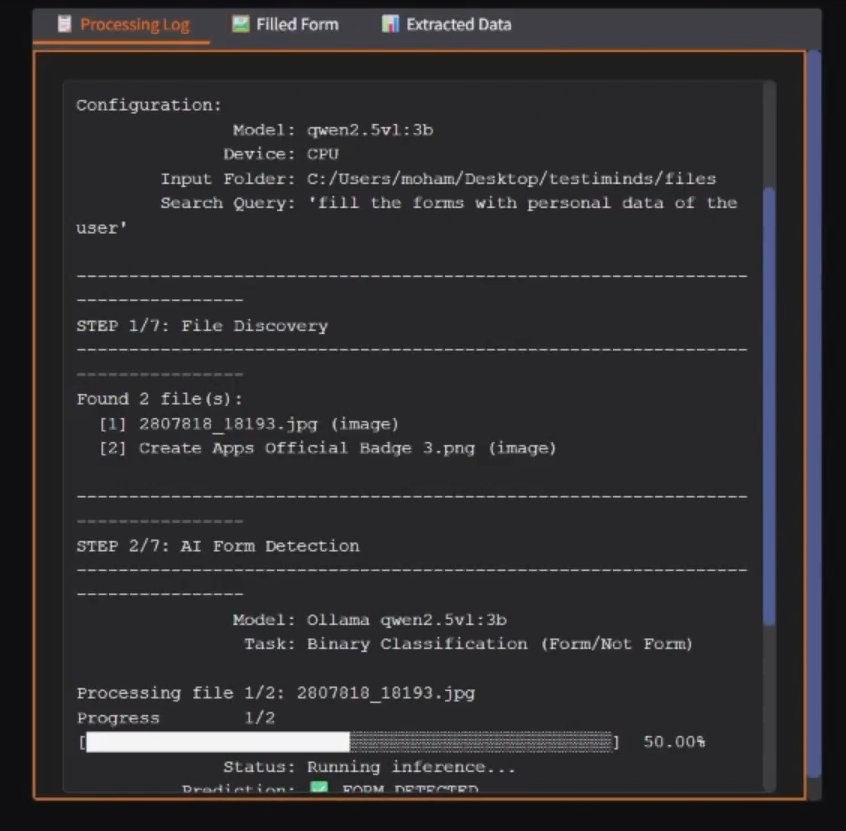
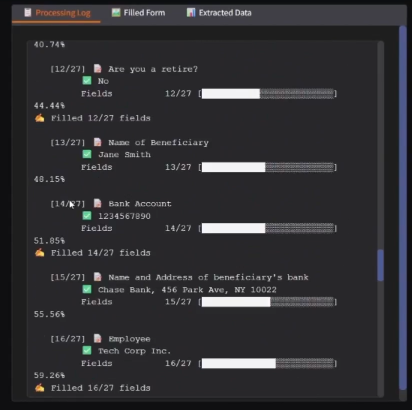
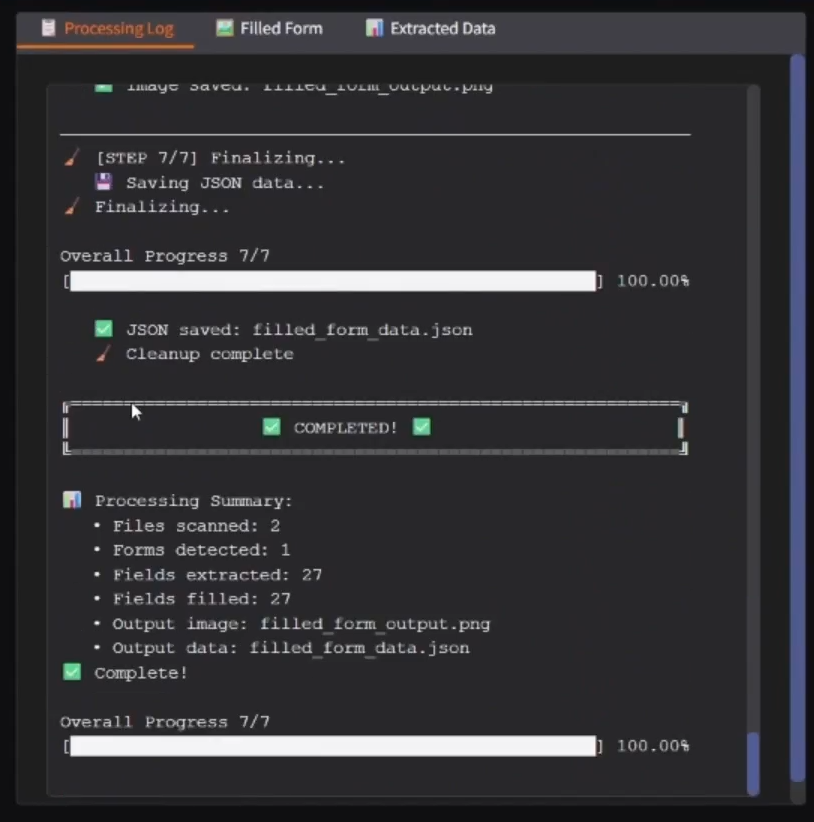
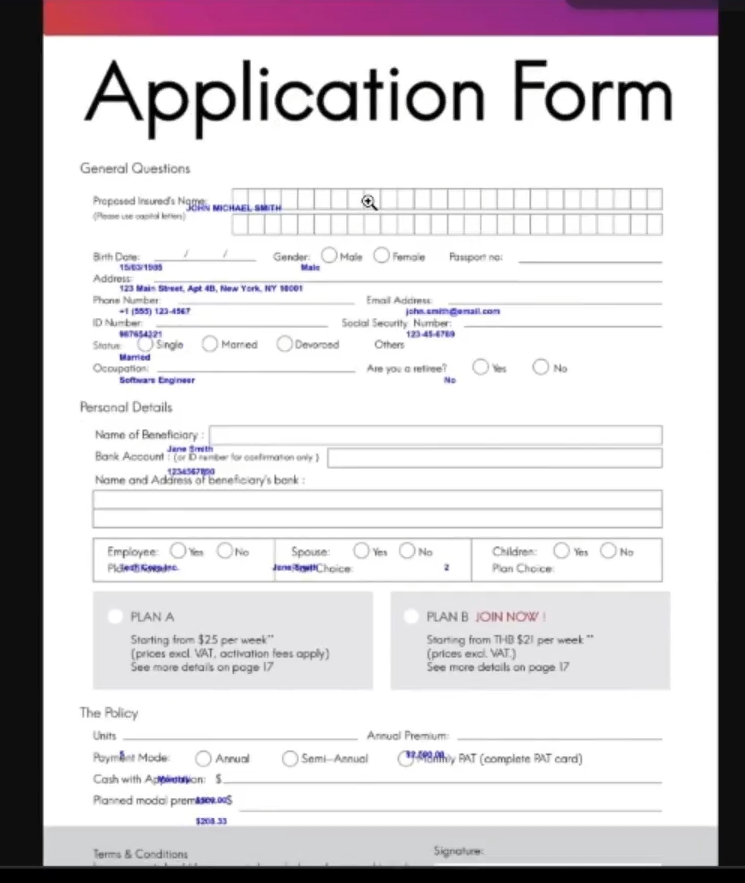
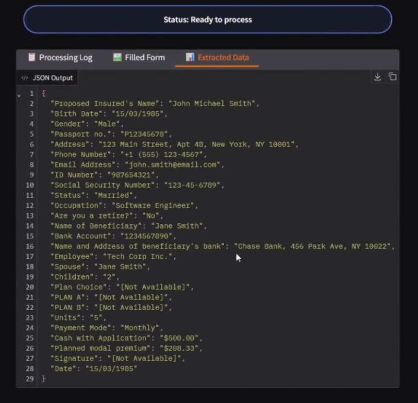
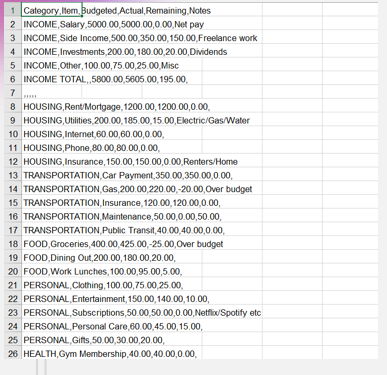
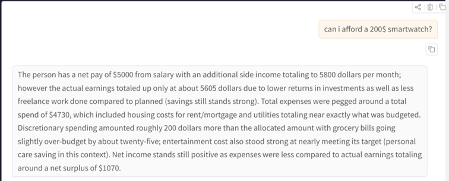

# AI-MINDS

<p>
  
  
  
  
  
  
  
</p>

AI-MINDS is a local-first, multi-agent intelligence platform for analyzing personal/work files, building persistent memory, and answering complex queries through a REPL-driven reasoning loop.

It combines:
- A FastAPI microservices backend
- A Gradio frontend with task-focused tabs
- A recursive LLM + tool-use engine (RLM)
- Memory and knowledge-graph components for long-term context

## Why AI-MINDS

Most assistants answer a single prompt and forget everything else. AI-MINDS is designed for iterative work:
- Ingest and parse real files (CSV, JSON, PDF, DOCX, XLSX, TXT, etc.)
- Run agentic analysis with traceable steps
- Persist useful context in memory
- Build and visualize a knowledge graph
- Expose everything through API + UI

## Core Architecture

Your high-level flow (matching your diagrams):

1. User query enters root orchestration.
2. Root agent delegates work to specialized sub-agents inside sandboxed execution.
3. Retrieval + tool agents parse files and run analysis.
4. Memory and knowledge graph enrich the next decisions.
5. Testing agent validates behavior (LangWatch scenarios).
6. Final answer is returned with logs and execution trace.

## Project Structure

```text
AI-MINDS/
  backend/
    api/                    # API gateway + routers + schemas + services
    rlm/                    # Recursive LLM engine, agents, REPL, tracing
    data/                   # Memory + graph artifacts
    logs/                   # Backend RLM traces
    requirements.txt
  frontend/
    ui/tabs/                # Gradio tabs (budget/files/memory/pipeline/etc.)
    logs/                   # Frontend RLM traces
    data/                   # Frontend-local memory data
    app.py                  # Main frontend entrypoint
  readme.md
```

## Features

- Multi-service API gateway (`/api/v1/*`)
- Budget analysis and affordability checks
- File listing + parsing + content-level extraction
- RLM REPL execution with filesystem tool-calling
- Prompt chunking pipeline (worker sub-agents + aggregator)
- Persistent memory retrieval and storage
- Knowledge graph generation and search
- Built-in backend test triggers from UI
- JSONL tracing for every RLM turn

## Tech Stack

- Python
- FastAPI + Uvicorn
- Gradio
- Cognee
- Ollama-compatible LLM endpoints
- Daytona sandbox integration
- Mem0-style memory store (local)
- Knowledge graph tooling 

## Quick Start

### 1. Clone and install

```bash
git clone <your-repo-url>
cd AI-MINDS
python -m venv .venv
.venv\Scripts\activate
pip install -r backend/requirements.txt
```

### 2. Configure environment

Create `backend/.env` (or update existing) with at least:

```env
RLM_API_URL=http://localhost:11434/v1
RLM_API_KEY=ollama
RLM_ROOT_MODEL=phi4-mini:latest
RLM_WORKER_MODEL=qwen2.5:3b
RLM_SUB_MODEL=qwen2.5:3b

RLM_CHUNK_SIZE=24000
RLM_CHUNK_OVERLAP=300
RLM_MAX_WORKERS=2
RLM_MAX_ITERATIONS=15
RLM_LOG_DIR=logs
```

Optional for Daytona:

```env
DAYTONA_API_KEY=
DAYTONA_API_URL=
RLM_ALLOWED_ROOTS=/workspace,/tmp/rlm
```

### 3. Run backend API gateway

```bash
cd backend
python api_server.py
```

Gateway:
- `http://127.0.0.1:8000`
- Swagger docs: `http://127.0.0.1:8000/docs`

### 4. Run frontend

```bash
cd frontend
python app.py
```

UI:
- `http://127.0.0.1:7860`

## API Domains

Main routers under `/api/v1`:
- `/budget`
- `/files`
- `/memory`
- `/pipeline`
- `/knowledge-graph`
- `/repl`
- `/testing`

Health endpoint:
- `/health`

## RLM Tracing and Logs

RLM sessions are recorded as JSONL traces, including:
- turn/iteration metadata
- model messages
- code blocks executed in REPL
- tool calls and outputs
- partial/final responses

Typical log locations:
- `backend/logs/rlm_trace_*.jsonl`
- `frontend/logs/rlm_trace_*.jsonl`

Example trace file:
- `frontend/logs/rlm_trace_20260215_043705_096693.jsonl`

## Screenshots and Demos

Create a folder like `docs/assets/` and place your images there.

### Architecture



### RLM Processing Logs





### App Snapshots






## Testing

Run backend test suites from root:

```bash
cd backend
python -m pytest rlm/test_budget_advisor.py -v
python -m pytest rlm/test_rlm_repl.py -v
```

Or run from the frontend `Testing` tab.

## Roadmap Ideas

- Rich trace viewer in UI (timeline + tool-call replay)
- Better source-citation grounding in final answers
- Multi-user memory isolation and export/import
- Streaming agent steps and live cost telemetry


